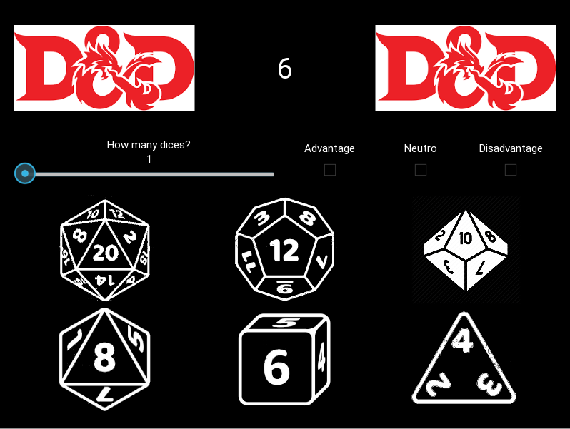

# D&D Dice Roll Program

This program was made to roll dices in a digital way, why you my ask? Well, maybe you don't have money to buy a set of dices (this is a sad reality in Brazil) or you are the DM and don't want your players to see when you thrown the dice. Either way you have a program that can roll a dice for you.

Enjoy! 

## Instructions

1. You have install kivy `pip3 install kivy`
2. Just run `python3 main.py`
